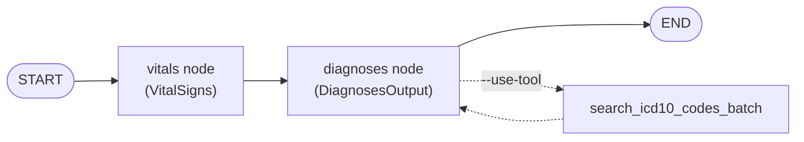
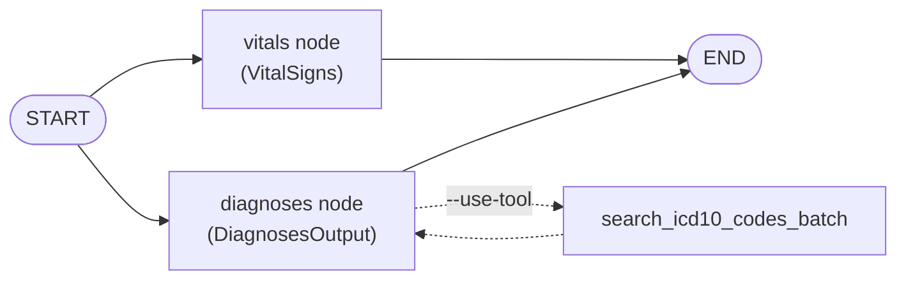

# Agents Evaluation Workshop

Un agent minimalista de medical-scribe construido con LangGraph. Lee la
transcripción (transcript) de una consulta médico–paciente, usa un modelo local
de Ollama ([`gemma4:e2b`](https://ollama.com/library/gemma4) por defecto) para extraer una nota clínica estructurada
y la guarda en `outputs/`. Los signos vitales (vitals) y los diagnósticos se
extraen mediante nodes (nodos) separados que pueden ejecutarse de forma
secuencial (por defecto) o en paralelo.

## Arquitectura

Dos nodes extraen la nota: un **vitals node** sin tools (`VitalSigns`) y un
**diagnoses node** (`DiagnosesOutput`) que opcionalmente puede llamar al tool de
búsqueda de ICD-10. Sus salidas se combinan en un único `ClinicalNote`.

**Secuencial (por defecto):**



**Paralelo (`--parallel`):**



## Prerequisites

Necesitas dos herramientas instaladas localmente:

- **[Ollama](https://ollama.com)** — para ejecutar el modelo local.
- **[uv](https://docs.astral.sh/uv/)** — para gestionar el entorno y las dependencias de Python.

1. Instala [Ollama](https://ollama.com) y descarga el modelo
   [`gemma4:e2b`](https://ollama.com/library/gemma4):

   ```bash
   ollama pull gemma4:e2b
   ```

2. Instala las dependencias con [uv](https://docs.astral.sh/uv/):

   ```bash
   uv sync
   ```

## Ejecutar el agent

Ejecuta con el transcript de ejemplo (se muestran los valores por defecto):

```bash
uv run python agent.py
```

Esto lee `data/transcript.txt`, imprime el `ClinicalNote` extraído y lo escribe
en `outputs/clinical_note.json`.

Puedes pasar tu propio transcript, un diagnoses prompt distinto y/o una ruta de
salida:

```bash
uv run python agent.py path/to/transcript.txt
uv run python agent.py path/to/transcript.txt -d prompts/diagnoses_prompt.txt
uv run python agent.py path/to/transcript.txt -o outputs/my_note.json
```

### Validación de códigos ICD-10

Agrega `--use-tool` para darle al agent un tool de fuzzy-search de ICD-10-CM
(en memoria) para que pueda buscar y validar los códigos de diagnóstico. Esto
también cambia el diagnoses prompt por defecto a
`prompts/diagnoses_prompt_with_tool.txt`.

```bash
uv run python agent.py --use-tool
```

### Ejecución secuencial vs. paralela

Por defecto, el vitals node y el diagnoses node se ejecutan de forma
**secuencial** (una llamada a Ollama a la vez), lo cual es confiable contra un
único servidor local. Agrega `--parallel` para ejecutarlos de forma concurrente
— esto requiere un servidor local de Ollama configurado para concurrencia
(`OLLAMA_NUM_PARALLEL >= 2`); de lo contrario, las llamadas simultáneas pueden
devolver respuestas vacías.

```bash
uv run python agent.py --parallel
```

Consulta todas las opciones con `uv run python agent.py --help`.

## Configuration

El modelo de Ollama se configura mediante la variable de entorno
`OLLAMA_MODEL` (por defecto [`gemma4:e2b`](https://ollama.com/library/gemma4)). Defínela en `.env` (ver
`.env.example`) o de forma inline:

```bash
OLLAMA_MODEL="llama3.1:8b" uv run python agent.py
```

## Prompts

Todos los prompts se leen desde archivos en `prompts/`, así que puedes editarlos
sin tocar el código:

- `prompts/system_prompt.txt` — el system prompt del agent (rol/instrucciones).
- `prompts/diagnoses_prompt.txt` — las instrucciones de extracción de
  diagnósticos, combinadas con el transcript en tiempo de ejecución. Puedes
  sobrescribirlo por ejecución con `-d/--diagnoses-prompt`.
- `prompts/diagnoses_prompt_with_tool.txt` — las instrucciones de extracción de
  diagnósticos usadas cuando `--use-tool` está activo (guían al agent a través
  del tool de ICD-10).
- `prompts/vitals_prompt.txt` — las instrucciones para el vitals node dedicado.

## Tracing (opcional)

El tracing con [Langfuse](https://langfuse.com) se habilita automáticamente
cuando las keys están definidas. Copia `.env.example` a `.env` y completa tus
valores `LANGFUSE_*` (public/secret key y `LANGFUSE_HOST`). Sin ellos, el agent
se ejecuta normalmente con el tracing deshabilitado.

## References to read later
- Constraint tax: https://arxiv.org/pdf/2606.25605 
