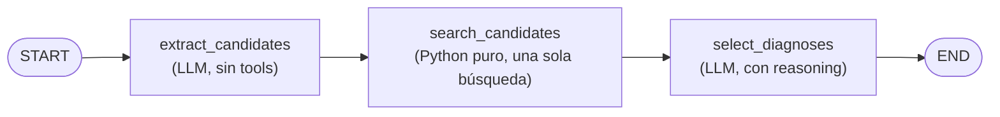
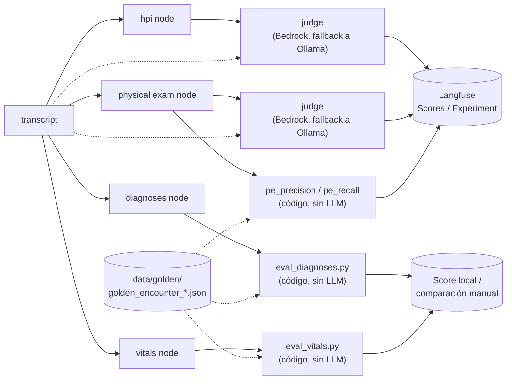

# Agents Evaluation Workshop

Un agent minimalista de medical-scribe construido con LangGraph. Lee la
transcripción (transcript) de una consulta médico–paciente, usa un modelo local
de Ollama ([`qwen3.5:9b`](https://ollama.com/library/qwen3.5:9b) por defecto) para extraer una nota clínica estructurada
y la guarda en `outputs/`. La historia de la enfermedad actual (HPI), los signos
vitales (vitals), el examen físico (physical exam) y los diagnósticos se extraen
mediante nodes (nodos) separados, ejecutados de forma secuencial.

Este repo es el material de un workshop: además del agent (`agent.py`) y sus
evals (`evals/`), incluye dos notebooks de [marimo](https://marimo.io) que
reconstruyen ambas piezas paso a paso — ver [Paso a paso del Workshop](#paso-a-paso-del-workshop).

## Arquitectura

Cuatro nodes extraen la nota, cada uno con su propio prompt y schema de salida,
todos construidos con una única función `build_agent(prompt, response_format,
tools)`:

- **hpi node** (`HistoryOfPresentIllness`) — redacta la historia de la enfermedad
  actual como un párrafo narrativo cronológico. Sin tools.
- **vitals node** (`VitalSigns`) — extrae los signos vitales. Sin tools.
- **physical exam node** (`PhysicalExam`) — documenta los hallazgos **objetivos**
  del examen físico (lo observado/medido por el clínico, no los síntomas referidos
  por el paciente), agrupados por sistema corporal. El sistema se restringe a un
  enum fijo (`PhysicalExamSystem`: general, heent, neck, cardiovascular,
  respiratory, …). Sin tools.
- **diagnoses node** (`DiagnosesOutput`) — extrae los diagnósticos diferenciales
  (los 3 más relevantes) y el assessment. Con `--use-tool` valida los códigos
  contra el tool de búsqueda de ICD-10, mediante un agent con tool-calling (por
  defecto) o, con `--deterministic`, mediante un pipeline de tres pasos con
  búsqueda determinística (ver más abajo).

Sus salidas se combinan en un único `ClinicalNote`.


### Diagnósticos determinísticos (`--deterministic`)

Con `--use-tool --deterministic`, el diagnoses node reemplaza el agent con
tool-calling por un pipeline fijo de tres pasos, para que la búsqueda de
ICD-10 ocurra exactamente una vez, en código, en vez de quedar a discreción
del modelo (que en la versión con tool-calling podía repetir o reformular la
búsqueda varias veces antes de converger):



1. **`extract_candidates`** — un LLM sin tools lista cada diagnóstico candidato
   discutido o implícito en el transcript (tanto diferenciales como
   assessment), junto con un `search_term` corto para buscarlo.
2. **`search_candidates`** — código puro: busca cada `search_term` una única
   vez contra el catálogo de ICD-10 (sin LLM de por medio).
3. **`select_diagnoses`** — un LLM (con reasoning habilitado) recibe el
   transcript original junto a los resultados ya buscados de cada candidato, y
   elige el código correcto de entre esos resultados — o descarta el
   candidato si ninguno es un match genuino — y consolida el resultado final.

```bash
uv run python agent.py --use-tool --deterministic
```

### Arquitectura de evaluación

Diagnósticos y vitals se evalúan de forma determinista (comparación campo por
campo contra un golden record); el HPI y el physical exam son texto libre, así
que se evalúan con un **judge** — un segundo modelo (LLM-as-a-Judge) que lee el
transcript y la salida y la califica, igual que lo haría un revisor humano. Los
resultados de ambos caminos se adjuntan a [Langfuse](https://langfuse.com) como
Scores, para poder compararlos entre corridas en la UI:



> **Diagrama de arquitectura (Excalidraw).** Espacio reservado para el
> diagrama de Mafe hecho en [Excalidraw](https://excalidraw.com/) con la
> arquitectura completa de agent + evaluación — agregar acá el embed/imagen
> cuando esté listo.
>
> <!-- TODO: pegar acá el link/imagen del diagrama de Excalidraw de Mafe -->

## Prerequisitos

Para correr el workshop completo (agent + Langfuse local + los dos notebooks)
necesitás:

- **Docker**, con soporte para Compose v2 (el comando `docker compose`, con
  espacio, no el viejo `docker-compose`) — ya sea [Docker Desktop](https://www.docker.com/products/docker-desktop/)
  o Docker Engine con el plugin Compose v2 instalado por separado.
- **15GB de espacio libre en disco**, para los modelos LLM locales (Ollama) y
  las imágenes de Docker de la instancia local de Langfuse.
- **[uv](https://docs.astral.sh/uv/)** — para gestionar el entorno y las
  dependencias de Python.
- **[Ollama](https://ollama.com)** — para ejecutar los modelos locales
  (generador y, opcionalmente, judge de fallback).
- **Acceso a Amazon Bedrock** — credenciales AWS (p. ej. vía `aws sso login`)
  con permiso `bedrock:InvokeModel` / `bedrock:InvokeModelWithResponseStream`,
  para el judge por defecto del notebook de LLM-as-a-Judge. Sin esto, el judge
  cae automáticamente a un modelo local de Ollama (ver [Modelo juez](#modelo-juez)),
  así que no es estrictamente bloqueante — pero sin Bedrock vas a estar
  evaluando con el modelo de fallback todo el workshop.

## Instrucciones de instalación

1. Copiá `.env.example` a `.env` (todos los defaults ya alcanzan para una
   instancia local de un solo uso; ver [Tracing (opcional)](#tracing-opcional)
   si querés generar tus propios secrets):

   ```bash
   cp .env.example .env
   ```

2. Levantá Langfuse localmente (tracing + Scores + Experiments de las evals):

   ```bash
   docker compose up --build -d
   ```

   La UI queda disponible en http://localhost:3000 (`user@example.com` /
   `langfuse`). Ver [Tracing (opcional)](#tracing-opcional) para más detalle
   del stack (`langfuse-web`, `langfuse-worker`, `postgres`, `clickhouse`,
   `redis`, `minio`) y cómo bajarlo.

3. Instalá las dependencias de Python con [uv](https://docs.astral.sh/uv/):

   ```bash
   uv sync
   ```

4. Descargá con Ollama los modelos que usa el workshop:

   ```bash
   ollama pull qwen3.5:9b        # generador: los cuatro nodes del agent
   ollama pull mistral:latest    # judge de fallback, si Bedrock no está disponible
   ```

Con eso ya podés correr el agent (`uv run python agent.py --help`) y los dos
notebooks del workshop.

## Paso a paso del Workshop

Los dos notebooks viven en `notebooks/` y se abren con marimo:

```bash
uv run marimo edit notebooks/1_building_an_agent.py
uv run marimo edit notebooks/2_llm_as_judge_eval.py
```

(`marimo edit` abre el notebook en modo interactivo, celda por celda; marimo
usa el directorio del propio notebook —`notebooks/`— como working directory,
por eso las rutas dentro de cada notebook son relativas a esa carpeta y no a
la raíz del repo).

### Notebook 1 — Building an agent (`notebooks/1_building_an_agent.py`)

Reconstruye el agent de `agent.py` pieza por pieza, corriendo cada pieza **en
vivo** contra un transcript real (encuentro `RIV-001`) — sin resultados
precalculados. Cubre, en orden:

1. **El schema es el contrato** — los modelos de Pydantic en `models.py`
   restringen lo que el LLM puede devolver, antes de tocar un solo prompt.
2. **Un sub-agent de punta a punta (HPI)** — la receta completa de
   `create_agent(model=..., system_prompt=..., tools=..., response_format=...)`,
   y por qué el node de HPI usa `ProviderStrategy(schema=...)` en vez de la
   estrategia de salida estructurada por defecto.
3. **Por qué cuatro sub-agents, no uno** — un modelo local pequeño al que se
   le pide llenar un schema grande mientras corre un tool tiende a dejar
   campos vacíos; separar HPI, vitals, physical exam y diagnósticos en nodes
   enfocados evita ese problema.
4. **Diagnósticos, con y sin tool** — la línea base sin herramienta, el agent
   con tool-calling, y el **flujo de trabajo determinista**
   (`--deterministic`): extraer candidatos → buscar una sola vez en código →
   seleccionar el código correcto, reemplazando el bucle autónomo de
   tool-calling por un pipeline fijo de tres pasos (ver
   [Diagnósticos determinísticos](#diagnósticos-determinísticos---deterministic)
   arriba).
5. **Componer los nodes en un grafo** — cómo `agent.py` conecta los cuatro
   nodes en un `StateGraph` de LangGraph y ensambla el `ClinicalNote` final.

### Notebook 2 — LLM as a judge (`notebooks/2_llm_as_judge_eval.py`)

Toma el HPI y el physical exam generados por el notebook 1 y pregunta si son
*buenos* — la parte que un diff determinista no puede responder, porque
ambas secciones son texto libre. Cubre:

1. **Por qué estas dos secciones necesitan un judge, no un diff** —
   diagnósticos (códigos ICD-10) y vitals (campos numéricos) sí se pueden
   comparar campo por campo contra un golden record; HPI y physical exam no
   tienen una única versión "correcta".
2. **El contrato del judge** — los schemas `HPIJudgeScore`/`PEJudgeScore` de
   `models.py`: cada dimensión (**Accuracy**, **Completeness**, **Tone**, 0
   a 4) va acompañada de una justificación, no solo un número.
3. **Selección del modelo judge** — Amazon Bedrock por defecto, con fallback
   automático a un modelo local de Ollama **distinto** al generador, para
   evitar que un modelo se auto-prefiera al calificarse a sí mismo (sesgo de
   autofavorecimiento).
4. **Evaluando el HPI y el physical exam en vivo**, reutilizando
   directamente (no reconstruyendo) las piezas de `evals/eval_hpi_judge.py`
   y `evals/judge_client.py` que ya corren en producción — más una prueba de
   calibración en cada sección (degradar deliberadamente la salida y
   verificar que el score correspondiente cae).
5. **Lo que el judge deliberadamente no evalúa** — la cobertura de sistemas
   corporales del physical exam se mide aparte, de forma determinista, como
   `precision`/`recall` contra un set de referencia (mismo criterio que
   `evals/eval_clinical_note_dataset.py`).

**Cómo se integra con Langfuse.** El notebook corre todo en memoria y muestra
los scores ahí mismo; en producción, `evals/eval_hpi_judge.py` adjunta sus tres
scores a la observation `hpi` de un trace ya existente
(`client.create_score(...)`), y `evals/eval_clinical_note_dataset.py` adjunta
las ocho métricas — HPI (`hpi_accuracy`/`hpi_completeness`/`hpi_tone`),
physical exam (`pe_accuracy`/`pe_completeness`/`pe_tone`) y cobertura
(`pe_precision`/`pe_recall`) — a una misma Experiment/DatasetRun sobre el
golden dataset, para que las ocho queden lado a lado en la UI de Langfuse a
través de distintos modelos/prompts. Ver [Evals](#evals) más abajo para correr
esos scripts contra Langfuse de verdad.

## Ejecutar el agente

Ejecuta con el transcript de ejemplo (se muestran los valores por defecto):

```bash
uv run python agent.py
```

Esto lee `data/transcript.txt`, imprime el `ClinicalNote` extraído y lo escribe
en `outputs/clinical_note.json`.

Puedes pasar tu propio transcript, un diagnoses prompt distinto y/o una ruta de
salida:

```bash
uv run python agent.py path/to/transcript.txt
uv run python agent.py path/to/transcript.txt -d prompts/diagnoses_prompt.txt
uv run python agent.py path/to/transcript.txt -o outputs/my_note.json
```

### Validación de códigos ICD-10

Agrega `--use-tool` para darle al agent un tool de fuzzy-search de ICD-10-CM
(en memoria) para que pueda buscar y validar los códigos de diagnóstico. Esto
también cambia el diagnoses prompt por defecto a
`prompts/diagnoses_prompt_with_tool.txt`.

```bash
uv run python agent.py --use-tool
```

### Ejecutar solo algunos nodes

Los cuatro nodes son independientes entre sí (ninguno depende de la salida de
otro), así que podés correr solo un subconjunto con `--only`, o excluir
algunos con `--skip` — útil para iterar rápido sobre un node (p. ej. mientras
ajustás un prompt) sin pagar el costo de correr los demás:

```bash
uv run python agent.py --only hpi
uv run python agent.py --skip diagnoses
```

Los nodes que no corren quedan con su valor por defecto/vacío en el
`ClinicalNote` resultante (p. ej. `hpi=""`, `assessment` vacío).

### Caching de nodos

Agrega `--cache` para cachear en disco el resultado de cada node. En una
ejecución posterior con las mismas entradas (mismo transcript, mismo prompt y
mismo modelo), ese node **omite la llamada al LLM** y devuelve el resultado
guardado — útil para re-correr el pipeline (p. ej. durante evaluaciones) sin
pagar de nuevo las llamadas lentas al modelo local.

```bash
uv run python agent.py --cache
```

La clave de caché de cada node incluye el transcript, el prompt efectivo de ese
node (rol del sistema + prompt de la tarea), el modelo y la temperatura. Por eso,
**editar un prompt re-ejecuta solo el node afectado**; los demás siguen sirviendo
desde caché. El cache es persistente entre procesos (un `DiskCache` que implementa
la interfaz `BaseCache` de LangGraph, en `cache.py`), a diferencia del
`InMemoryCache` integrado, que no sobrevive al proceso.

Para borrar todos los resultados cacheados:

```bash
uv run python agent.py --clear-cache
```

Consulta todas las opciones con `uv run python agent.py --help`.

## Configuración

El comportamiento del agent se configura mediante variables de entorno.
Defínelas en `.env` (ver `.env.example`) o de forma inline:

- `OLLAMA_MODEL` — el modelo de Ollama a usar (por defecto
  [`qwen3.5:9b`](https://ollama.com/library/qwen3.5:9b)).
- `OLLAMA_TEMPERATURE` — temperatura de sampling (por defecto `0.1`; más baja =
  más determinista).
- `OLLAMA_TIMEOUT` — timeout por request al servidor de Ollama, en segundos (por
  defecto `300`). Súbelo si un modelo local lento supera el tiempo límite.
- `LLM_MAX_RETRIES` — reintentos de una llamada al modelo fallida, p. ej. una
  respuesta estructurada vacía, antes de rendirse (por defecto `5`; usa backoff
  exponencial).
- `LANGGRAPH_CACHE_DIR` — directorio del cache de nodos en disco, usado con
  `--cache` (por defecto `.cache/scribe`).
- `LANGGRAPH_CACHE_TTL` — TTL en segundos para los resultados cacheados
  (opcional; vacío = sin expiración, un hit se sirve solo con entradas idénticas).

```bash
OLLAMA_MODEL="llama3.1:8b" uv run python agent.py
```

## Prompts

Todos los prompts se leen desde archivos en `prompts/`, así que puedes editarlos
sin tocar el código:

| Archivo | Usado por | Instrucciones |
| --- | --- | --- |
| `prompts/system_prompt.txt` | todos los nodes | Rol/instrucciones compartidos del scribe; se antepone al prompt de cada node para formar su system prompt. |
| `prompts/hpi_prompt.txt` | hpi node | Redacción de la historia de la enfermedad actual como párrafo narrativo. |
| `prompts/vitals_prompt.txt` | vitals node | Extracción de los signos vitales. |
| `prompts/physical_exam_prompt.txt` | physical exam node | Hallazgos del examen físico por sistema corporal. |
| `prompts/diagnoses_prompt.txt` | diagnoses node (sin `--use-tool`) | Extracción de diagnósticos (los 3 diferenciales más relevantes + assessment). Puedes sobrescribirlo por ejecución con `-d/--diagnoses-prompt`. |
| `prompts/diagnoses_prompt_with_tool.txt` | diagnoses node (`--use-tool`, sin `--deterministic`) | Guía al agent con tool-calling a través del tool de ICD-10. |
| `prompts/diagnoses_candidates_prompt.txt` | `extract_candidates` (`--use-tool --deterministic`) | Lista los diagnósticos candidatos y su `search_term`, sin asignar códigos. |
| `prompts/diagnoses_selection_prompt.txt` | `select_diagnoses` (`--use-tool --deterministic`) | Elige el código de cada candidato a partir de los resultados ya buscados, y consolida el resultado final. |
| `prompts/hpi_judge_prompt.txt` | judge de HPI (`evals/eval_hpi_judge.py`, notebook 2) | Rúbrica de Accuracy/Completeness/Tone (0-4) para el HPI generado. |
| `prompts/physical_exam_judge_prompt.txt` | judge de physical exam (`evals/eval_clinical_note_dataset.py`, notebook 2) | Rúbrica de Accuracy/Completeness/Tone (0-4) para los hallazgos del physical exam. |

## Tracing (opcional)

El tracing con [Langfuse](https://langfuse.com) se habilita automáticamente
cuando las keys están definidas. Sin ellas, el agent se ejecuta normalmente
con el tracing deshabilitado.

### Levantar Langfuse localmente

El repo incluye un `docker-compose.yml` (basado en el
[self-hosting oficial de Langfuse](https://langfuse.com/self-hosting), v3) para
correr una instancia local completa: `langfuse-web`, `langfuse-worker`,
`postgres`, `clickhouse`, `redis` y `minio`. `.env.example` ya trae **todos**
los valores que necesita — infra secrets, keys y el seed de org/project/user —
así que no hay nada que generar ni configurar:

```bash
cp .env.example .env   # si aún no lo hiciste
docker compose up --build -d
```

Eso es todo. La UI queda en http://localhost:3000 — inicia sesión con
`user@example.com` / `langfuse`. El proyecto sembrado usa directamente tus
`LANGFUSE_PUBLIC_KEY`/`LANGFUSE_SECRET_KEY` de `.env` como las keys del
proyecto (ver `docker-compose.yml`), así que el agent ya traza contra esta
instancia sin ningún paso extra.

Para bajar el stack:

```bash
docker compose down          # conserva los datos (volumes)
docker compose down -v       # borra también los volumes (reset completo)
```

Si preferís no auto-provisionar nada y crear el org/project/user a mano desde
la UI, comentá `LANGFUSE_INIT_ORG_ID` en `.env` — es el interruptor maestro:
sin él, Langfuse no crea nada aunque el resto de `LANGFUSE_INIT_*` esté
definido.

#### Generar tus propias keys y secrets (opcional)

Los defaults de `.env.example` son solo para una instancia local de un solo
uso. Si vas a compartir esta instancia con alguien más, o querés un proyecto
Langfuse propio en vez del dummy sembrado, genera tus propios valores.
Ningún valor real debe vivir en `docker-compose.yml` (queda trackeado en
git); todos van en tu `.env` local (gitignored). Comandos para generar cada
uno:

- **`LANGFUSE_PUBLIC_KEY` / `LANGFUSE_SECRET_KEY`** — el formato que valida
  Langfuse es `pk-lf-<uuid>` / `sk-lf-<uuid>`. Para arrancar un proyecto nuevo
  desde cero:

  ```bash
  echo "LANGFUSE_PUBLIC_KEY=pk-lf-$(uuidgen | tr 'A-Z' 'a-z')"
  echo "LANGFUSE_SECRET_KEY=sk-lf-$(uuidgen | tr 'A-Z' 'a-z')"
  ```

  Alternativa: dejar `LANGFUSE_INIT_*` sin definir, crear el proyecto a mano en
  la UI (http://localhost:3000) y copiar las keys que Langfuse genera ahí a tu
  `.env`.
- **`ENCRYPTION_KEY`** — 256 bits en hex: `openssl rand -hex 32`
- **`SALT`** y **`NEXTAUTH_SECRET`** — 256 bits en base64:
  `openssl rand -base64 32`
- **`POSTGRES_PASSWORD`**, **`CLICKHOUSE_PASSWORD`**, **`REDIS_AUTH`**,
  **`MINIO_ROOT_PASSWORD`**, **`LANGFUSE_INIT_USER_PASSWORD`** — cualquier
  password fuerte, p. ej.: `openssl rand -base64 18`

Después de generarlos, agrégalos a tu `.env` (no a `docker-compose.yml` ni a
`.env.example`) y reinicia el stack (`docker compose up --build -d`) para que
tomen efecto.

## Evals

Todos los scripts de evaluación viven en `evals/` (se corren siempre desde la
raíz del repo, no desde adentro de `evals/`, para que sus paths relativos a
`prompts/`/`data/` resuelvan bien):

- `evals/eval_hpi_judge.py` / `evals/eval_clinical_note_dataset.py` — LLM-as-a-Judge,
  requieren Langfuse + un juez (Bedrock u Ollama). Comparten la selección de
  modelo juez vía `evals/judge_client.py` (no se corre directamente). El
  notebook 2 (`notebooks/2_llm_as_judge_eval.py`) muestra esta misma lógica
  corriendo en vivo, celda por celda — ver [Paso a paso del Workshop](#paso-a-paso-del-workshop).
- `evals/eval_diagnoses.py` / `evals/eval_vitals.py` / `evals/eval_trajectory.py` —
  funciones puras, sin Langfuse ni LLM.

### HPI LLM-as-a-Judge

`evals/eval_hpi_judge.py` califica un HPI ya generado (una traza existente en
Langfuse) contra su transcript, en tres dimensiones — 0 a 4 cada una, ver
`prompts/hpi_judge_prompt.txt` — **Accuracy** (fidelidad al transcript),
**Completeness** (cobertura del contenido relevante) y **Tone** (registro de
documentación clínica). Adjunta los resultados de vuelta a Langfuse como
Scores (`hpi_accuracy`, `hpi_completeness`, `hpi_tone`).

Requiere una traza existente con un node `hpi` — corré `agent.py` con
tracing habilitado (ver arriba) al menos una vez antes.

```bash
uv run python evals/eval_hpi_judge.py                        # usa la traza más reciente
uv run python evals/eval_hpi_judge.py --trace-id <trace_id>  # traza específica
```

#### Modelo juez

El juez usa un modelo distinto al `OLLAMA_MODEL` del generador a propósito —
evita el sesgo de que un modelo se auto-prefiera al calificarse a sí mismo:

- **Amazon Bedrock** (por defecto) — requiere credenciales AWS en el entorno
  (p. ej. `aws sso login`) con permiso `bedrock:InvokeModel` /
  `bedrock:InvokeModelWithResponseStream`.
- **Fallback a Ollama local** — si la llamada a Bedrock falla (sin internet,
  credenciales vencidas, sin acceso al modelo), reintenta automáticamente
  contra un modelo local distinto al del generador, y lo deja registrado en
  el `comment`/metadata del score.

Variables de entorno (ver `.env.example`, sección `HPI LLM-AS-A-JUDGE`):

- `JUDGE_BEDROCK_MODEL_ID` — model id o inference profile de Bedrock (por
  defecto `us.anthropic.claude-sonnet-4-5-20250929-v1:0`).
- `AWS_REGION` — región de Bedrock (por defecto `us-east-1`).
- `JUDGE_FALLBACK_OLLAMA_MODEL` — modelo local de respaldo (por defecto
  `mistral:latest`); debe ser distinto de `OLLAMA_MODEL`.

### Clinical Note Dataset Eval (HPI + Physical Exam)

`evals/eval_clinical_note_dataset.py` es el carril offline/regresión: corre la
extracción de HPI + Physical Exam para cada encuentro golden y adjunta 8
evaluators (LLM-judge + code) a un mismo Experiment/DatasetRun en Langfuse
(ver el docstring del archivo para el detalle de qué mide cada score).

Los encuentros golden se leen de `data/golden/golden_encounter_*.json`
(emparejados con su transcript en `data/encounter_*.txt` por `encounter_id`,
p. ej. `"encounter_id": "RIV-001"` -> `data/encounter_riv001.txt`) — se pasan
como argumento en vez de estar hardcodeados en el script:

```bash
uv run python evals/eval_clinical_note_dataset.py                                                   # los 2 encuentros default
uv run python evals/eval_clinical_note_dataset.py --golden-file data/golden/golden_encounter_riv001.json  # solo uno (repetible)
uv run python evals/eval_clinical_note_dataset.py --run-name mi-corrida-de-prueba
```

Requiere Langfuse corriendo (ver arriba) y el mismo juez que `evals/eval_hpi_judge.py`
(Bedrock por defecto, fallback a Ollama local).

> **Nota:** `pe_precision`/`pe_recall` (breakdown del Physical Exam por
> sistema corporal) todavía se comparan contra una referencia hardcodeada en
> `PE_SYSTEM_REFERENCE` dentro del script, en vez de leerla de
> `golden_encounter_*.json` — ese archivo guarda `physical_exam` como texto
> libre, no como lista por sistema. Ver TODO.md §10 ("Open questions / risks").

### Evals determinísticos (diagnósticos, vitals, trayectoria)

`evals/eval_diagnoses.py`, `evals/eval_vitals.py` y `evals/eval_trajectory.py`
son funciones puras — sin llamadas a Langfuse ni a ningún LLM — que comparan
una nota clínica extraída (p. ej. `outputs/encounter_2.json`, generado por
`agent.py`) o una traza de tool calls contra un `golden_encounter_*.json`.
Por ahora no tienen CLI propia: se importan y se llaman desde tu propio
script, REPL o notebook (`evals/run_evals.py` es un stub vacío, pensado como
futuro punto de entrada para correr los tres a la vez).

## Autores

- **Nicolas Roldan** — ML Engineer @ Loka
- **Mafe Castaño** — ML Engineer @ Loka
