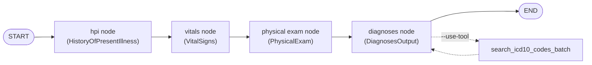
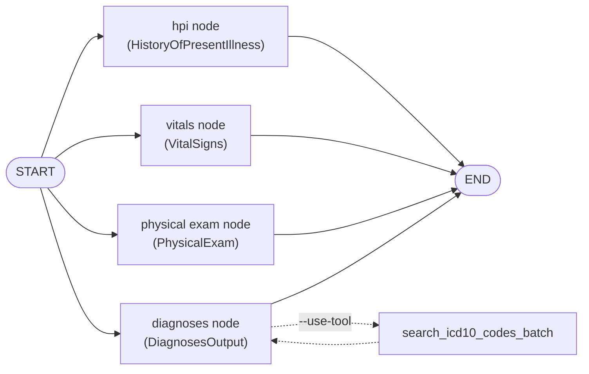

# Agents Evaluation Workshop

Un agent minimalista de medical-scribe construido con LangGraph. Lee la
transcripción (transcript) de una consulta médico–paciente, usa un modelo local
de Ollama ([`gemma4:e2b`](https://ollama.com/library/gemma4) por defecto) para extraer una nota clínica estructurada
y la guarda en `outputs/`. La historia de la enfermedad actual (HPI), los signos
vitales (vitals), el examen físico (physical exam) y los diagnósticos se extraen
mediante nodes (nodos) separados que pueden ejecutarse de forma secuencial (por
defecto) o en paralelo.

## Arquitectura

Cuatro nodes extraen la nota, cada uno con su propio prompt y schema de salida,
todos construidos con una única función `build_agent(prompt, response_format,
tools)`:

- **hpi node** (`HistoryOfPresentIllness`) — redacta la historia de la enfermedad
  actual como un párrafo narrativo cronológico. Sin tools.
- **vitals node** (`VitalSigns`) — extrae los signos vitales. Sin tools.
- **physical exam node** (`PhysicalExam`) — documenta los hallazgos **objetivos**
  del examen físico (lo observado/medido por el clínico, no los síntomas referidos
  por el paciente), agrupados por sistema corporal. El sistema se restringe a un
  enum fijo (`PhysicalExamSystem`: general, heent, neck, cardiovascular,
  respiratory, …). Sin tools.
- **diagnoses node** (`DiagnosesOutput`) — extrae los diagnósticos diferenciales
  (los 3 más relevantes) y el assessment; opcionalmente llama al tool de búsqueda
  de ICD-10.

Sus salidas se combinan en un único `ClinicalNote`.

**Secuencial (por defecto):**



**Paralelo (`--parallel`):**



## Prerequisites

Necesitas dos herramientas instaladas localmente:

- **[Ollama](https://ollama.com)** — para ejecutar el modelo local.
- **[uv](https://docs.astral.sh/uv/)** — para gestionar el entorno y las dependencias de Python.

1. Instala [Ollama](https://ollama.com) y descarga el modelo
   [`gemma4:e2b`](https://ollama.com/library/gemma4):

   ```bash
   ollama pull gemma4:e2b
   ```

2. Instala las dependencias con [uv](https://docs.astral.sh/uv/):

   ```bash
   uv sync
   ```

## Ejecutar el agente

Ejecuta con el transcript de ejemplo (se muestran los valores por defecto):

```bash
uv run python agent.py
```

Esto lee `data/transcript.txt`, imprime el `ClinicalNote` extraído y lo escribe
en `outputs/clinical_note.json`.

Puedes pasar tu propio transcript, un diagnoses prompt distinto y/o una ruta de
salida:

```bash
uv run python agent.py path/to/transcript.txt
uv run python agent.py path/to/transcript.txt -d prompts/diagnoses_prompt.txt
uv run python agent.py path/to/transcript.txt -o outputs/my_note.json
```

### Validación de códigos ICD-10

Agrega `--use-tool` para darle al agent un tool de fuzzy-search de ICD-10-CM
(en memoria) para que pueda buscar y validar los códigos de diagnóstico. Esto
también cambia el diagnoses prompt por defecto a
`prompts/diagnoses_prompt_with_tool.txt`.

```bash
uv run python agent.py --use-tool
```

### Ejecución secuencial vs. paralela

Por defecto, los cuatro nodes (hpi, vitals, physical exam y diagnoses) se
ejecutan de forma **secuencial** (una llamada a Ollama a la vez), lo cual es
confiable contra un único servidor local. Agrega `--parallel` para ejecutarlos de
forma concurrente — esto requiere un servidor local de Ollama configurado para
concurrencia (`OLLAMA_NUM_PARALLEL >= 4`); de lo contrario, las llamadas
simultáneas pueden devolver respuestas vacías.

```bash
uv run python agent.py --parallel
```

### Caching de nodos

Agrega `--cache` para cachear en disco el resultado de cada node. En una
ejecución posterior con las mismas entradas (mismo transcript, mismo prompt y
mismo modelo), ese node **omite la llamada al LLM** y devuelve el resultado
guardado — útil para re-correr el pipeline (p. ej. durante evaluaciones) sin
pagar de nuevo las llamadas lentas al modelo local.

```bash
uv run python agent.py --cache
```

La clave de caché de cada node incluye el transcript, el prompt efectivo de ese
node (rol del sistema + prompt de la tarea), el modelo y la temperatura. Por eso,
**editar un prompt re-ejecuta solo el node afectado**; los demás siguen sirviendo
desde caché. El cache es persistente entre procesos (un `DiskCache` que implementa
la interfaz `BaseCache` de LangGraph, en `cache.py`), a diferencia del
`InMemoryCache` integrado, que no sobrevive al proceso.

Para borrar todos los resultados cacheados:

```bash
uv run python agent.py --clear-cache
```

Consulta todas las opciones con `uv run python agent.py --help`.

## Configuration

El comportamiento del agent se configura mediante variables de entorno.
Defínelas en `.env` (ver `.env.example`) o de forma inline:

- `OLLAMA_MODEL` — el modelo de Ollama a usar (por defecto
  [`gemma4:e2b`](https://ollama.com/library/gemma4)).
- `OLLAMA_TEMPERATURE` — temperatura de sampling (por defecto `0.1`; más baja =
  más determinista).
- `OLLAMA_TIMEOUT` — timeout por request al servidor de Ollama, en segundos (por
  defecto `300`). Súbelo si un modelo local lento supera el tiempo límite.
- `LLM_MAX_RETRIES` — reintentos de una llamada al modelo fallida, p. ej. una
  respuesta estructurada vacía, antes de rendirse (por defecto `5`; usa backoff
  exponencial).
- `LANGGRAPH_CACHE_DIR` — directorio del cache de nodos en disco, usado con
  `--cache` (por defecto `.cache/scribe`).
- `LANGGRAPH_CACHE_TTL` — TTL en segundos para los resultados cacheados
  (opcional; vacío = sin expiración, un hit se sirve solo con entradas idénticas).

```bash
OLLAMA_MODEL="llama3.1:8b" uv run python agent.py
```

## Prompts

Todos los prompts se leen desde archivos en `prompts/`, así que puedes editarlos
sin tocar el código:

- `prompts/system_prompt.txt` — el rol/instrucciones compartidos del scribe; se
  antepone al prompt de cada node para formar su system prompt.
- `prompts/hpi_prompt.txt` — las instrucciones para el hpi node (redacción de la
  historia de la enfermedad actual como párrafo narrativo).
- `prompts/vitals_prompt.txt` — las instrucciones para el vitals node dedicado.
- `prompts/physical_exam_prompt.txt` — las instrucciones para el physical exam
  node (hallazgos por sistema corporal).
- `prompts/diagnoses_prompt.txt` — las instrucciones de extracción de
  diagnósticos (los 3 diferenciales más relevantes + assessment). Puedes
  sobrescribirlo por ejecución con `-d/--diagnoses-prompt`.
- `prompts/diagnoses_prompt_with_tool.txt` — las instrucciones de extracción de
  diagnósticos usadas cuando `--use-tool` está activo (guían al agent a través
  del tool de ICD-10).

## Tracing (opcional)

El tracing con [Langfuse](https://langfuse.com) se habilita automáticamente
cuando las keys están definidas. Copia `.env.example` a `.env` y completa tus
valores `LANGFUSE_*` (public/secret key y `LANGFUSE_HOST`). Sin ellos, el agent
se ejecuta normalmente con el tracing deshabilitado.

### Levantar Langfuse localmente

El repo incluye un `docker-compose.yml` (basado en el
[self-hosting oficial de Langfuse](https://langfuse.com/self-hosting), v3) para
correr una instancia local completa: `langfuse-web`, `langfuse-worker`,
`postgres`, `clickhouse`, `redis` y `minio`.

```bash
cp .env.example .env   # si aún no lo hiciste
docker compose up -d
```

`.env.example` ya trae valores de desarrollo listos para copiar y pegar (ver la
sección `LOCAL LANGFUSE INSTANCE`), así que no hay nada que configurar para
levantar una instancia funcional:

- Los infra secrets (`SALT`, `ENCRYPTION_KEY`, `NEXTAUTH_SECRET`,
  `POSTGRES_PASSWORD`, `CLICKHOUSE_PASSWORD`, `REDIS_AUTH`,
  `MINIO_ROOT_PASSWORD`) ya coinciden con los defaults de `docker-compose.yml`.
- Las variables `LANGFUSE_INIT_*` siembran un org/project/user dummy (`org` /
  `project` / `user@example.com` / `langfuse` / `langfuse`) en el primer
  arranque. La UI queda en http://localhost:3000 — inicia sesión con
  `user@example.com` / `langfuse`.

Para un uso más allá de tu propia máquina, sobrescribe cualquiera de esos
valores en tu `.env` (los que aplica están marcados `CHANGEME`).

Si prefieres no auto-provisionar nada y crear el org/project/user a mano desde
la UI, comenta `LANGFUSE_INIT_ORG_ID` en `.env` — es el interruptor maestro:
sin él, Langfuse no crea nada aunque el resto de `LANGFUSE_INIT_*` esté
definido.

El proyecto sembrado usa directamente tus `LANGFUSE_PUBLIC_KEY`/
`LANGFUSE_SECRET_KEY` (ver `docker-compose.yml`) como
`LANGFUSE_INIT_PROJECT_PUBLIC_KEY`/`_SECRET_KEY`, así que ambos pares nunca
quedan desincronizados — para que el agent trace contra esta instancia solo
tienes que definir esas dos keys una vez.

#### Generar las keys y secrets

Los defaults de `.env.example` sirven para una instancia local de un solo uso;
para cualquier otro caso, genera tus propios valores. Ningún valor real debe
vivir en `docker-compose.yml` (queda trackeado en git); todos van en tu `.env`
local (gitignored). Comandos para generar cada uno:

- **`LANGFUSE_PUBLIC_KEY` / `LANGFUSE_SECRET_KEY`** — el formato que valida
  Langfuse es `pk-lf-<uuid>` / `sk-lf-<uuid>`. Para arrancar un proyecto nuevo
  desde cero:

  ```bash
  echo "LANGFUSE_PUBLIC_KEY=pk-lf-$(uuidgen | tr 'A-Z' 'a-z')"
  echo "LANGFUSE_SECRET_KEY=sk-lf-$(uuidgen | tr 'A-Z' 'a-z')"
  ```

  Alternativa: dejar `LANGFUSE_INIT_*` sin definir, crear el proyecto a mano en
  la UI (http://localhost:3000) y copiar las keys que Langfuse genera ahí a tu
  `.env`.
- **`ENCRYPTION_KEY`** — 256 bits en hex: `openssl rand -hex 32`
- **`SALT`** y **`NEXTAUTH_SECRET`** — 256 bits en base64:
  `openssl rand -base64 32`
- **`POSTGRES_PASSWORD`**, **`CLICKHOUSE_PASSWORD`**, **`REDIS_AUTH`**,
  **`MINIO_ROOT_PASSWORD`**, **`LANGFUSE_INIT_USER_PASSWORD`** — cualquier
  password fuerte, p. ej.: `openssl rand -base64 18`

Después de generarlos, agrégalos a tu `.env` (no a `docker-compose.yml` ni a
`.env.example`) y reinicia el stack (`docker compose up -d`) para que tomen
efecto.

Para bajar el stack:

```bash
docker compose down          # conserva los datos (volumes)
docker compose down -v       # borra también los volumes (reset completo)
```

## References to read later
- Constraint tax: https://arxiv.org/pdf/2606.25605 
